# LinkedIn Courses Data Analysis Project (Using SQL) 
----
### | 

## Introduction

This project leverages a LinkedIn Courses dataset to analyze course offerings on the platform and derive insights regarding course distribution, duration, release patterns, and trends. The analysis was conducted in SQL, focusing on cleaning and transforming the dataset, and generating insights using SQL functions.

## Problem Statement

The goal was to analyze and organize LinkedIn course data to reveal distribution patterns by category, trends in course release over time, course duration, and other insights valuable for understanding user engagement with course content on the platform.

1. Basic Course Distribution (By Category)
2. Courses Released by Year and Year_month.
3. Average Duration by Category and Top 10 Longest Courses
4. How can we categorise courses by their duration.

## Skills/Concepts Demonstrated

- Data Cleaning: Used SQL commands to filter and remove records with missing or irrelevant data.
- Data Transformation: Converted complex duration formats into a uniform, analyzable time metric in minutes.
- Aggregation and Analysis: Aggregated data by categories, release dates, and quartiles.
- Window Functions: Applied functions like LAG, ROW_NUMBER, and NTILE to perform ranking, calculate time gaps, and segment courses into quartiles.
- Rolling Totals: Calculated cumulative duration over time, showcasing SQL proficiency in calculating running totals.
- Subqueries and CTEs: Used subqueries and common table expressions (CTEs) to structure and simplify complex transformations and calculations.

## Data Sourcing

The dataset, containing fields such as course titles, release dates, categories, durations, and descriptions, was sourced from Kaggle. 

## Data Transformation

Some of the important transformation steps are highlighted here

Here is an image of the table before transformation
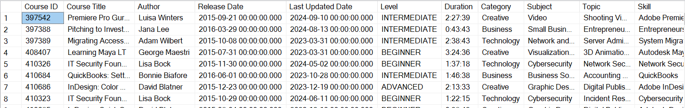

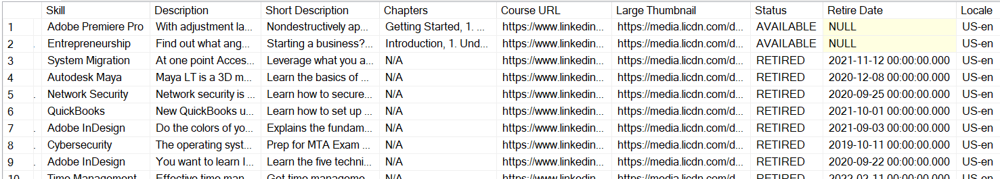

### Steps followed 

1)Data Cleaning: Removed courses with missing duration values using the SQL DELETE statement to ensure data consistency and reliability.

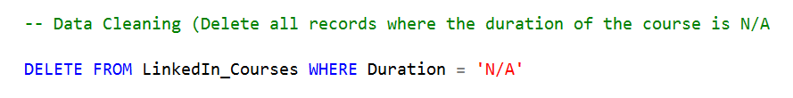

2)Course Distribution by Category: Aggregated the data to find the number of courses offered in each category. The results highlighted the most popular course categories and enabled comparisons across different areas of expertise.

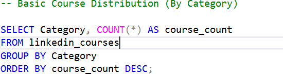 | 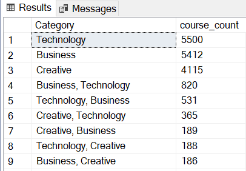

3)Release Trends: Analyzed courses by release year and month to observe any release trends or patterns over time. Subqueries were used to extract year and year-month formats from release dates, and aggregation provided an overview of course offerings by year.

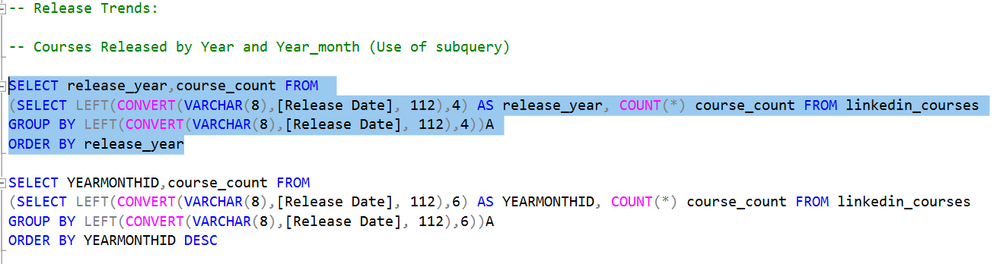 | 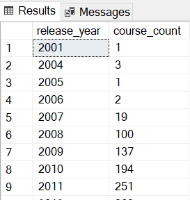
----------------------
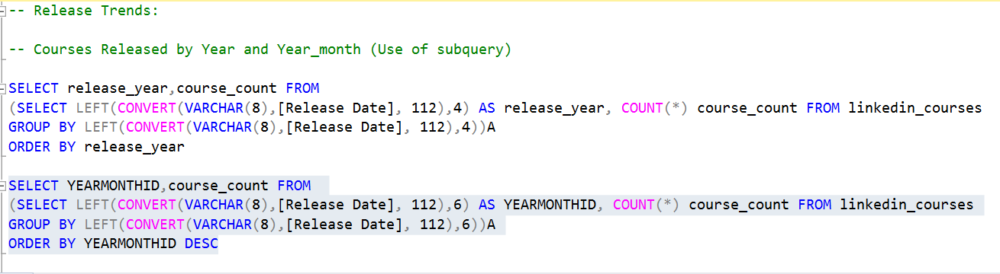 | 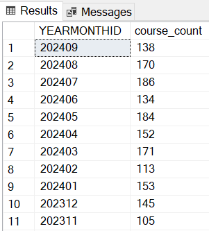

4)Course Duration Transformation: Converted complex duration formats hh:mm:ss into minutes. This transformation allowed for standardized duration analysis across all courses.

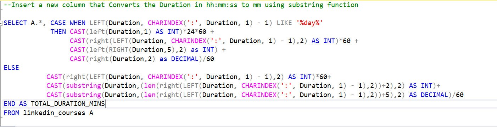

5)Average Duration by Category: Calculated the average duration per category by dividing the total duration by the count of courses in each category, identifying categories with longer or more detailed course offerings.

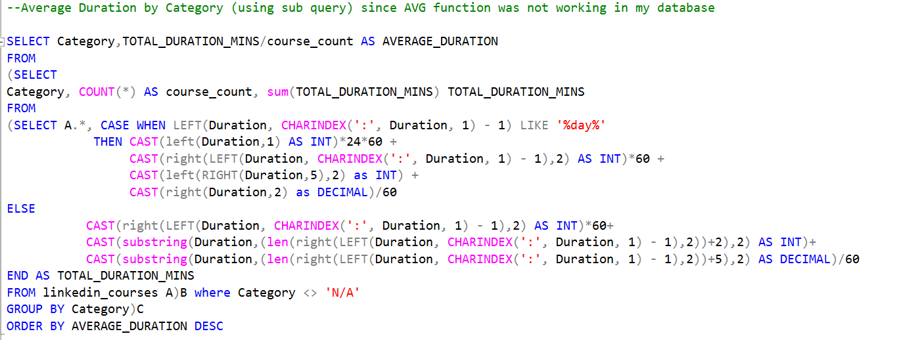 | 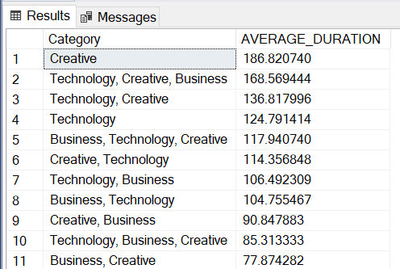

6)Top 10 Longest Courses: Used ROW_NUMBER to rank courses by duration within each locale, identifying the ten longest courses for deeper insights into extended content.

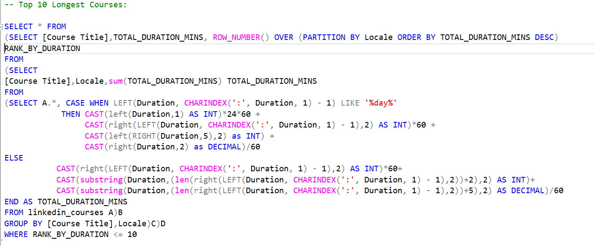 | 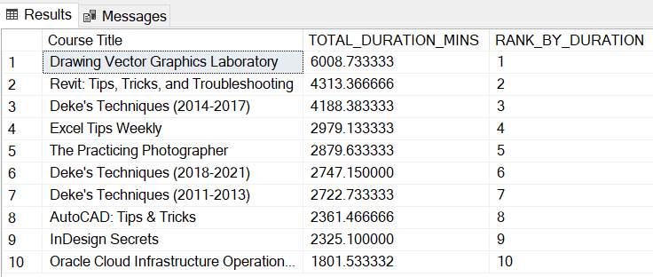

7)Gap Analysis Using LAG: Calculated the gap between consecutive course releases within each category, providing insights into the content cadence and frequency of course updates.

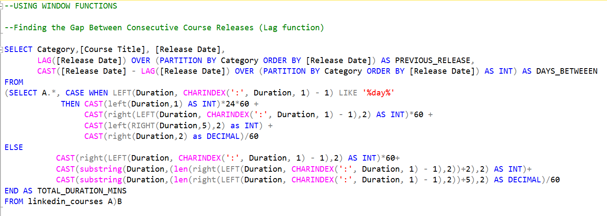 | 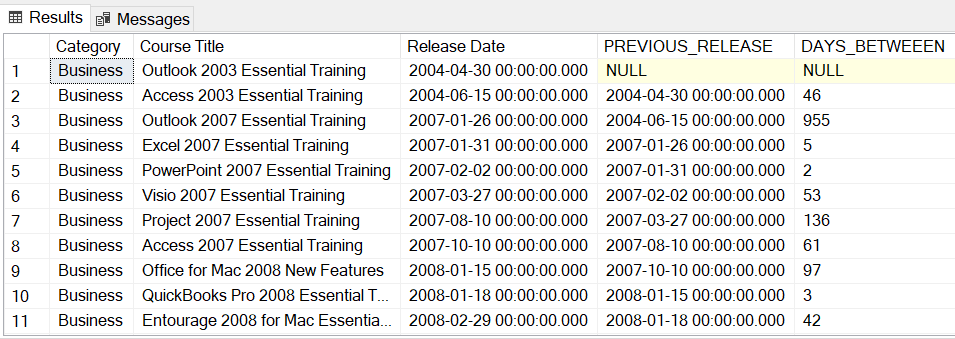

8)Quartile Segmentation: Segmented courses into quartiles based on duration, categorizing them as ‘Top 25%’, ‘Top 26%-50%’, etc., to classify courses by length and potentially by content depth.

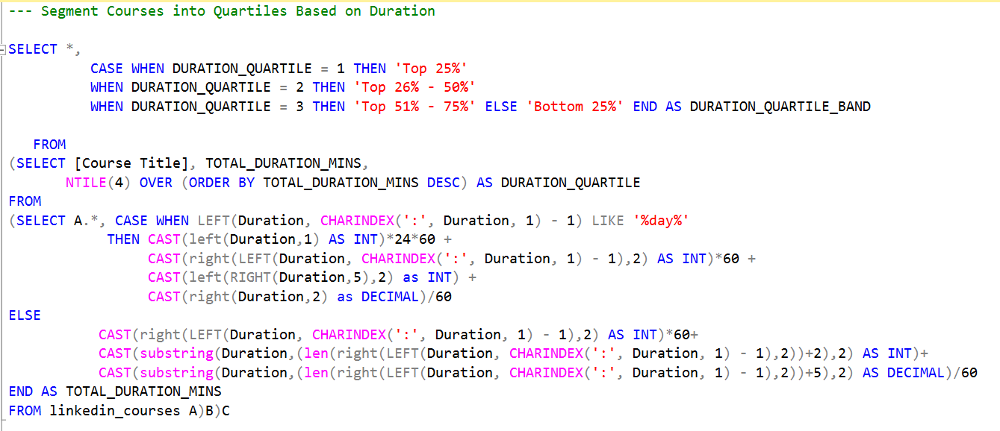 | 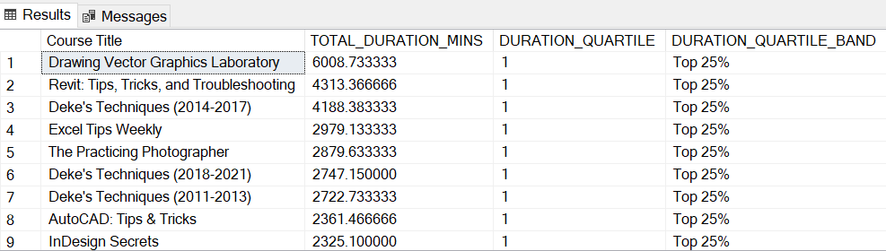

9)Running Total of Duration: Used a cumulative sum function within a CTE to calculate the running total of course duration, which helped visualize how total available content has grown over time.

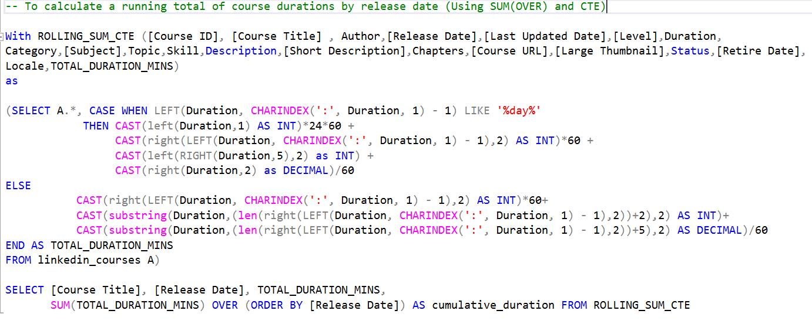 | 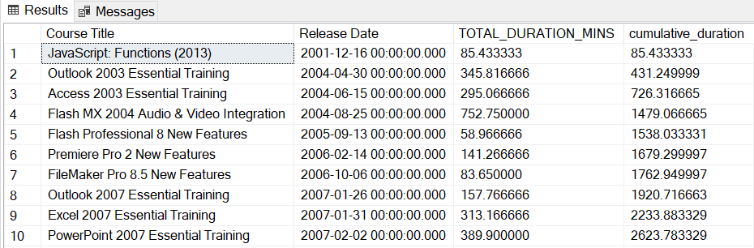

## Recommendations and Conclusion
This analysis provided a comprehensive view of LinkedIn course offerings, identifying key categories and durations that may appeal to different user segments. Regular updates and longer-duration courses are evident in popular categories, indicating robust content production in high-demand skills. 
To enhance user engagement, LinkedIn could:

- Promote categories with high durations or frequent updates.
- Encourage shorter courses in less popular categories to attract users looking for quick skill acquisition.
- Optimize course release schedules based on gaps identified in specific categories.

Overall, this project demonstrated advanced SQL capabilities, showcasing data cleaning, transformation, and analytical skills suitable for supporting data-driven decisions in educational content strategy.
